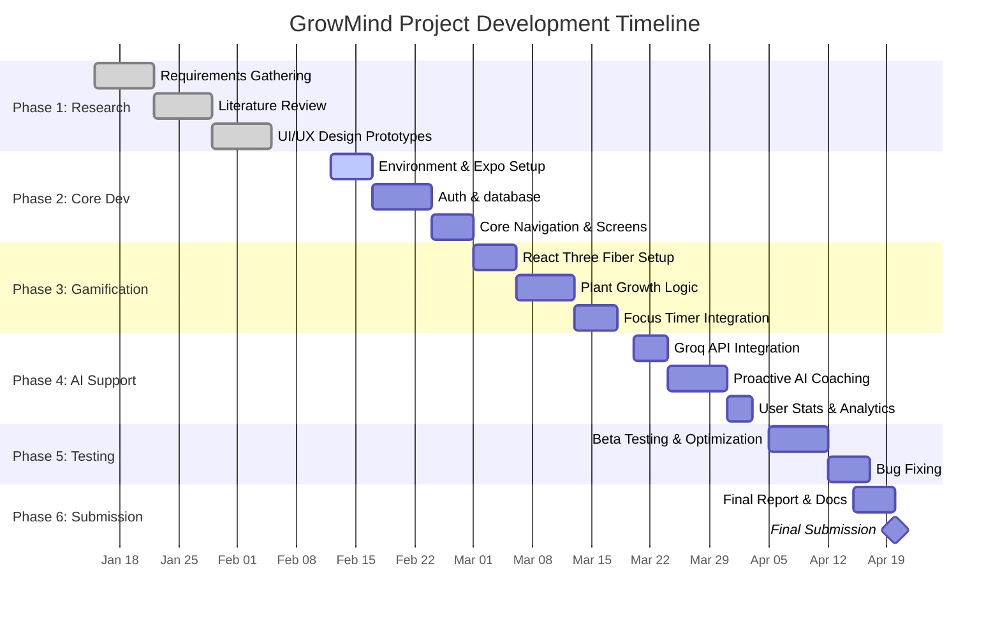

# GrowMind Development Gantt Chart (Compressed)

The following is the updated project timeline, condensed to conclude in mid-April 2026.

## Phase Breakdown
*   **Phase 1-2**: Foundation building and establishing the core mobile environment.
*   **Phase 3**: Developing the visual 3D reward system (Plants).
*   **Phase 4**: Integrating the high-speed Groq AI engine for coaching.
*   **Phase 5-6**: Final quality assurance and academic document completion by late April.
